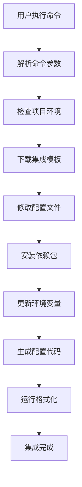

# Vibe CLI - SaaS 模板脚手架工具 PRD

## 📋 产品概述

**一句话说明白：Vibe CLI 是一个"SaaS 应用搭建神器"，让开发者用一行命令就能快速搭建出完整的在线服务系统。**

想象一下：
- 🏠 **盖房子需要什么？** 地基、墙体、水电、装修...
- 💻 **搭建在线服务需要什么？** 用户登录、支付系统、数据库、多语言支持...
- ⚡ **我们的工具做什么？** 就像"预制房屋工具包"，让你不用从零开始，一键搭建完整系统！

### 🎯 产品愿景
**让每个有想法的人都能在半小时内搭建出自己的在线服务产品。**

不管你是：
- 🚀 想做独立开发者的程序员
- 💡 有创业想法的产品经理  
- 🎨 想要技术实现想法的设计师
- 🏢 需要快速验证想法的企业家

### 💡 核心价值主张

**问题：** 搭建一个完整的在线服务很复杂，需要几周甚至几个月
**解决：** 我们把复杂的事情简单化，让你专注于核心业务

- **🎯 超简单**：一行命令解决复杂配置，不需要懂技术细节
- **⚡ 超快速**：30分钟搭建完成，不是30天
- **🏆 超专业**：内置最佳实践，媲美大厂技术架构
- **🔧 超灵活**：需要什么功能就加什么，不浪费资源

---

## 🤔 你是否遇到过这些问题？

- ❌ 有好想法但不知道如何快速实现？
- ❌ 想做个在线服务但技术门槛太高？
- ❌ 每次都要重复搭建用户登录、支付等基础功能？
- ❌ 想要专业的系统架构但没有大厂技术团队？

**如果你有以上任何一个痛点，Vibe CLI 就是为你而生！**

## 💭 你愿意使用这样的产品吗？

如果有一个工具能让你：
- 🚀 **30分钟**搭建出完整的在线服务系统
- 💰 **免费使用**所有基础功能
- 🛠️ **一行命令**就能添加用户登录、支付、多语言等功能
- 📱 **自动生成**现代化的用户界面
- 🔒 **企业级安全**和稳定性保证

**你会想要尝试吗？** 

👉 **请在评论区告诉我们你的想法！**

## 🚀 核心功能特性

### 1. 中间件快速集成
支持通过简单命令快速集成主流 SaaS 服务和中间件：

```bash
# 国际化支持
vibe install i18n

# 用户认证系统
vibe install auth --provider=clerk

# 支付系统
vibe install payments --provider=stripe

# 数据库配置
vibe install database --provider=supabase

# 邮件服务
vibe install email --provider=resend

# 文件存储
vibe install storage --provider=cloudinary

# 监控分析
vibe install analytics --provider=mixpanel
```

### 2. 项目模板管理
```bash
# 创建新项目
vibe create my-saas --template=ai-saas

# 查看可用模板
vibe templates list

# 添加自定义模板
vibe templates add --name=custom --path=./template
```

### 3. 配置管理
```bash
# 查看当前配置
vibe config list

# 设置全局配置
vibe config set --key=default-provider --value=vercel

# 环境变量管理
vibe env set --key=STRIPE_SECRET_KEY --value=sk_test_xxx
```

### 4. 项目状态检查
```bash
# 检查项目健康状态
vibe health

# 检查缺失的依赖
vibe doctor

# 更新已安装的中间件
vibe update --all
```

## 🏗️ 支持的中间件和服务

### 认证服务 (Auth)
| 提供商 | 安装命令 | 特性 |
|--------|----------|------|
| Clerk | `vibe install auth --provider=clerk` | 开箱即用UI、社交登录 |
| NextAuth | `vibe install auth --provider=nextauth` | 灵活配置、多提供商 |
| Supabase Auth | `vibe install auth --provider=supabase` | 开源、数据库集成 |

### 支付系统 (Payments)
| 提供商 | 安装命令 | 特性 |
|--------|----------|------|
| Stripe | `vibe install payments --provider=stripe` | 全球支付、订阅管理 |
| Paddle | `vibe install payments --provider=paddle` | 税务处理、全球合规 |
| LemonSqueezy | `vibe install payments --provider=lemonsqueezy` | 独立开发者友好 |

### 数据库服务 (Database)
| 提供商 | 安装命令 | 特性 |
|--------|----------|------|
| Supabase | `vibe install database --provider=supabase` | PostgreSQL、实时功能 |
| PlanetScale | `vibe install database --provider=planetscale` | MySQL、分支管理 |
| Neon | `vibe install database --provider=neon` | PostgreSQL、无服务器 |

### 国际化 (i18n)
| 方案 | 安装命令 | 特性 |
|------|----------|------|
| next-intl | `vibe install i18n --provider=next-intl` | Next.js 优化、静态生成 |
| react-i18next | `vibe install i18n --provider=react-i18next` | 成熟方案、丰富生态 |

### 邮件服务 (Email)
| 提供商 | 安装命令 | 特性 |
|--------|----------|------|
| Resend | `vibe install email --provider=resend` | 现代API、开发者友好 |
| SendGrid | `vibe install email --provider=sendgrid` | 企业级、高送达率 |
| Mailgun | `vibe install email --provider=mailgun` | 灵活配置、强大API |

### 文件存储 (Storage)
| 提供商 | 安装命令 | 特性 |
|--------|----------|------|
| Cloudinary | `vibe install storage --provider=cloudinary` | 图片处理、CDN |
| AWS S3 | `vibe install storage --provider=s3` | 可靠稳定、成本控制 |
| Supabase Storage | `vibe install storage --provider=supabase` | 开源、权限控制 |

### 分析监控 (Analytics)
| 提供商 | 安装命令 | 特性 |
|--------|----------|------|
| Mixpanel | `vibe install analytics --provider=mixpanel` | 用户行为分析 |
| PostHog | `vibe install analytics --provider=posthog` | 开源、功能全面 |
| Google Analytics | `vibe install analytics --provider=ga4` | 免费、网站分析 |

### 部署服务 (Deployment)
| 提供商 | 安装命令 | 特性 |
|--------|----------|------|
| Vercel | `vibe install deploy --provider=vercel` | Next.js 原生支持 |
| Netlify | `vibe install deploy --provider=netlify` | 静态站点、边缘函数 |
| Railway | `vibe install deploy --provider=railway` | 全栈部署、数据库 |

## 🛠️ 技术实现方案

### 1. CLI 架构设计

```
vibeTemplate/
├── client/                  # 前端项目 (JS/TS)
│   ├── components/          # 组件层 (基于 shadcn)
│   ├── pages/              # 页面层
│   ├── hooks/              # 钩子层
│   ├── services/           # 前端服务层 (面向对象)
│   └── README.md           # 前端开发文档
├── server/                 # 后端项目 (TypeScript)
│   ├── router/             # 接口层
│   │   ├── investor/       # 投资者相关接口
│   │   ├── elite/          # 精英用户相关接口
│   │   ├── task/           # 任务相关接口
│   │   └── ai/             # AI 相关接口
│   ├── service/            # 业务逻辑实现层
│   ├── repository/         # 数据操作层
│   ├── database/           # 数据库表结构
│   └── README.md           # 后端开发文档
├── cli/                    # CLI 工具代码
│   ├── commands/           # 命令处理器
│   │   ├── create.ts       # vibe create
│   │   ├── add.ts          # vibe add
│   │   ├── update.ts       # vibe update
│   │   └── revise.ts       # vibe revise
│   ├── integrations/       # 集成器
│   │   ├── i18n/           # 国际化集成
│   │   ├── auth/           # 认证集成
│   │   ├── payment/        # 支付集成
│   │   └── k8s/            # K8S 集成
│   ├── templates/          # 项目模板
│   └── utils/              # 工具函数
├── types/                  # 类型定义
│   └── interface/          # 前后端共享接口定义 (TypeScript)
├── env.template            # 环境变量模板
├── tsconfig.json           # TypeScript 配置
└── README.md               # 项目总体说明
```

### 2. 核心指令集

```bash
# 创建新项目
vibe create

# 国际化相关
vibe add i18n
vibe update locale

# 通用添加功能
vibe add

# 用户认证系统
vibe add user --supabase --google

# 容器化部署
vibe add k8s

# 支付系统
vibe add payment stripe
vibe add payment

# 项目修正
vibe revise
```

### 3. 工程文件架构

```
vibeTemplate/
├── client/                  # 前端项目 (JS/TS)
│   ├── components/          # 组件层 (基于 shadcn)
│   ├── pages/              # 页面层
│   ├── hooks/              # 钩子层
│   ├── services/           # 服务层 (面向对象)
│   ├── node_modules/       # 前端依赖
│   └── README.md           # 前端开发文档
├── server/                 # 后端项目 (TypeScript)
│   ├── router/             # 接口层
│   │   ├── investor/       # 投资者相关接口
│   │   ├── elite/          # 精英用户相关接口
│   │   ├── task/           # 任务相关接口
│   │   └── ai/             # AI 相关接口
│   ├── service/            # 业务逻辑实现层
│   ├── repository/         # 数据操作层
│   ├── database/           # 数据库表结构
│   ├── node_modules/       # 后端依赖
│   └── README.md           # 后端开发文档
├── types/                  # 类型定义
│   └── interface/          # 前后端共享接口定义 (TypeScript)
├── .git/                   # Git 版本控制
├── env.template            # 环境变量模板
├── tsconfig.json           # TypeScript 配置
└── README.md               # 项目总体说明
```

### 4. 团队分工模式 (MVP 快速开发)

#### 👥 团队配置
- **团队规模**: 2人全栈开发团队
- **开发模式**: 按功能模块分工，端到端交付
- **开发周期**: 1.5天快速MVP产品
- **协作方式**: 功能导向，全栈开发，共同维护

#### 🔄 分工策略

**按功能模块分工**
```
功能模块 A (开发者 A):
├── client/pages/auth/           # 认证页面
├── client/components/auth/      # 认证组件
├── server/router/auth/          # 认证接口
├── server/service/auth/         # 认证服务
└── types/interface/auth.ts      # 认证接口定义

功能模块 B (开发者 B):
├── client/pages/dashboard/      # 仪表板页面
├── client/components/dashboard/ # 仪表板组件
├── server/router/dashboard/     # 仪表板接口
├── server/service/dashboard/    # 仪表板服务
└── types/interface/dashboard.ts # 仪表板接口定义
```

**开发责任**
- **开发者 A**: 负责用户认证、用户管理相关的完整功能
- **开发者 B**: 负责核心业务功能、数据展示相关的完整功能
- **共同负责**: CLI工具开发、项目架构、部署配置

#### 🛡️ 协作规范

**端到端交付流程**
1. **功能分析** (30分钟): 明确功能需求和接口设计
2. **接口定义** (30分钟): 在 `types/interface/` 中定义接口
3. **并行开发** (6小时): 同时开发前端和后端
4. **自测联调** (1小时): 完成功能的端到端测试
5. **代码合并** (30分钟): 提交完整功能模块

**版本控制策略**
- 功能分支命名: `feature/auth-system`, `feature/dashboard`
- 提交信息: `feat(auth): complete user login and registration`
- 每个提交包含完整的前后端功能

**快速开发原则**
- 优先使用现成组件和库
- 简化数据库设计
- 最小化API接口
- 重点关注核心功能

### 5. 核心技术栈

#### CLI 框架
- **Commander.js**：命令行解析和处理
- **Inquirer.js**：交互式命令行界面
- **Chalk**：终端颜色输出
- **Ora**：加载动画效果

#### 文件操作
- **fs-extra**：增强的文件系统操作
- **Handlebars**：模板引擎
- **Prettier**：代码格式化
- **ESLint**：代码质量检查

#### 包管理
- **npm/yarn/pnpm**：支持多种包管理器
- **spawn**：执行子进程命令
- **semver**：版本管理

### 6. 集成工作流程



### 7. 配置文件结构

#### vibe.config.js
```javascript
module.exports = {
  // 项目元信息
  project: {
    name: 'my-saas',
    version: '1.0.0',
    template: 'ai-saas'
  },
  
  // 已安装的集成
  integrations: {
    auth: {
      provider: 'clerk',
      version: '6.16.0',
      config: {
        publishableKey: 'NEXT_PUBLIC_CLERK_PUBLISHABLE_KEY',
        secretKey: 'CLERK_SECRET_KEY'
      }
    },
    payments: {
      provider: 'stripe',
      version: '16.12.0',
      config: {
        publishableKey: 'NEXT_PUBLIC_STRIPE_PUBLISHABLE_KEY',
        secretKey: 'STRIPE_SECRET_KEY'
      }
    }
  },
  
  // 全局配置
  settings: {
    packageManager: 'npm',
    typescript: true,
    tailwind: true,
    eslint: true
  }
}
```

## 💻 使用示例

### 1. 创建新项目
```bash
# 使用 AI SaaS 模板创建项目
vibe create my-ai-app --template=ai-saas

# 交互式创建
vibe create
? 项目名称: my-ai-app
? 选择模板: AI SaaS Template
? 包管理器: npm
? 启用 TypeScript: Yes
? 启用 Tailwind CSS: Yes
```

### 2. 集成认证系统
```bash
# 安装 Clerk 认证
vibe install auth --provider=clerk

# 交互式安装
vibe install auth
? 选择认证提供商: Clerk
? 是否需要社交登录: Yes
? 选择社交登录平台: Google, GitHub
```

### 3. 集成支付系统
```bash
# 安装 Stripe 支付
vibe install payments --provider=stripe --subscription=true

# 配置会自动添加到项目中
# - Stripe 组件
# - 订阅管理页面
# - Webhook 处理
# - 价格计划配置
```

### 4. 国际化配置
```bash
# 安装国际化支持
vibe install i18n --provider=next-intl --locales=en,zh,ja

# 自动生成语言文件结构
messages/
├── en.json
├── zh.json
└── ja.json
```

## 🔧 高级功能

### 1. 自定义集成
开发者可以创建自定义集成器：

```typescript
// integrations/custom/my-service.ts
import { Integration } from '@vibe-cli/core'

export class MyServiceIntegration extends Integration {
  name = 'my-service'
  
  async install(options: any) {
    // 安装依赖
    await this.installPackages(['my-service-sdk'])
    
    // 修改配置文件
    await this.updateConfig({
      'my-service': {
        apiKey: 'MY_SERVICE_API_KEY'
      }
    })
    
    // 生成代码文件
    await this.generateFiles({
      'lib/my-service.ts': this.getTemplate('my-service-lib')
    })
  }
}
```

### 2. 插件系统
```bash
# 安装社区插件
vibe plugin install @vibe-cli/plugin-monitoring

# 查看已安装插件
vibe plugin list

# 卸载插件
vibe plugin uninstall @vibe-cli/plugin-monitoring
```

### 3. 模板市场
```bash
# 浏览模板市场
vibe marketplace browse

# 安装社区模板
vibe template install @community/blog-template

# 发布模板
vibe template publish --name=my-template
```

## 📊 MVP 开发计划 (1.5天完成)

### Day 1: 核心功能开发 (8小时)
**上午 (4小时)**
- [ ] 项目结构搭建 (30分钟)
- [ ] 基础CLI框架 (2小时)
- [ ] 核心命令实现 (1.5小时)
  - [ ] `vibe create` - 项目创建
  - [ ] `vibe add` - 功能添加

**下午 (4小时)**
- [ ] 2个核心集成器开发 (3小时)
  - [ ] 国际化集成 (`vibe add i18n`)
  - [ ] 认证集成 (`vibe add user --supabase --google`)
- [ ] 基础测试和调试 (1小时)

### Day 2 上半天: 完善和部署 (4小时)
**上午 (4小时)**
- [ ] 支付集成 (`vibe add payment stripe`) (1.5小时)
- [ ] 项目修正功能 (`vibe revise`) (1小时)
- [ ] 文档完善 (1小时)
- [ ] 最终测试和部署 (30分钟)

### MVP 核心功能范围
- ✅ 基础CLI命令 (create, add, update, revise)
- ✅ 3个核心集成器 (i18n, auth, payment)
- ✅ 简单的项目模板
- ✅ 基础文档和示例

## 📈 商业模式

### 免费版本
- 基础集成器（5个）
- 社区支持
- 开源模板

### 专业版本 ($29/月)
- 全部集成器
- 优先技术支持
- 高级模板
- 自定义集成 API

### 企业版本 ($99/月)
- 白标定制
- 专属技术支持
- 企业级集成
- 培训服务

## 🎯 成功指标

### 技术指标
- CLI 安装时间 < 30秒
- 单个集成完成时间 < 2分钟
- 支持 95% 的主流 SaaS 服务
- 代码测试覆盖率 > 90%

### 业务指标
- 6个月内获得 10,000+ 活跃用户
- 社区贡献的集成器 > 50个
- 客户满意度 > 4.5/5
- 月活跃用户增长率 > 20%

## 🤝 社区和生态

### 开源贡献
- GitHub 主仓库维护
- 社区集成器贡献机制
- 文档翻译计划
- 定期技术分享

### 合作伙伴
- SaaS 服务提供商官方合作
- 独立开发者社区推广
- 技术博主内容合作
- 在线教育平台课程合作

## 📚 相关资源

### 技术文档
- [集成器开发指南](./integration-guide.md)
- [模板创建教程](./template-guide.md)
- [API 参考文档](./api-reference.md)

### 社区资源
- [Discord 社区](https://discord.gg/vibe-cli)
- [GitHub 讨论区](https://github.com/vibe-cli/discussions)
- [官方博客](https://blog.vibe-cli.com)

---

**Vibe CLI - 让 SaaS 开发变得简单快捷！** 🚀